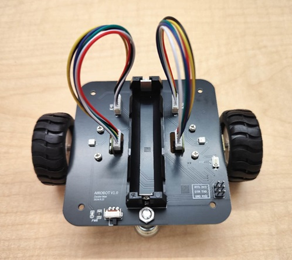

# AIROBOT

two-wheeled esp32 robot for Swarm related experiments.

Schematic referenced from https://github.com/todocono/swarmesh. Many thanks to [@todocono](https://github.com/todocono) and [@momoenomoto](https://github.com/momoenomoto)
for their help!

## Using guide

You need a USB-UART programmer to upload the firmware to your robot. **YOU HAVE TO CONNECT THE DTR PIN ON THE PROGRAMMING PORT TO ENTER THE CORRECT BOOT MODE FOR UPLOADING PROGRAM** (otherwise you have to manaully pull-down GPIO0 on the ESP32)

## OTA firmware distribution

TODO: Use painlessmeshboost to distribute the firmware?